# Diagramas completos do sistema (BPMN, UML e Modelo Lógico-Relacional)

Este documento consolida **todos os principais diagramas possíveis e úteis** para o sistema FriendlyEats deste repositório, cobrindo:

- Processos de negócio (visão BPMN);
- Diagramas UML (casos de uso, sequência, classes, atividades, estados, componentes, implantação, pacotes, comunicação e visão temporal);
- Modelo lógico-relacional (visão tabular relacional derivada do modelo operacional em Firestore).

> Observação: o backend usa Firestore (NoSQL). A modelagem lógico-relacional abaixo representa uma visão de governança e integração analítica, sem alterar a persistência operacional atual.

---

## 1) BPMN — Processos de Negócio (todos os fluxos centrais)

## 1.1 Cadastro de usuário

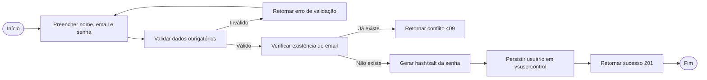

## 1.2 Login e verificação de credenciais

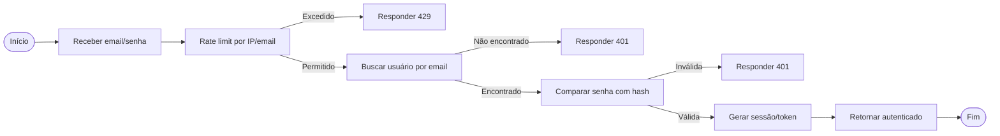

## 1.3 Recuperação de senha

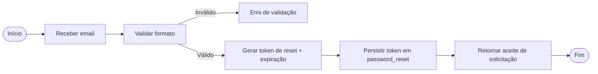

## 1.4 Consulta de catálogo/restaurantes

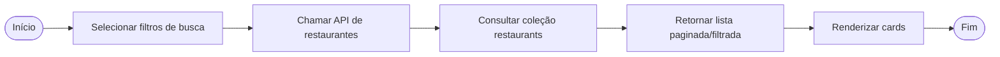

## 1.5 Publicação de avaliação (review)

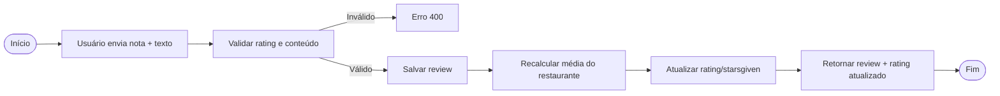

## 1.6 Operação do hub social (postagens e conversas)

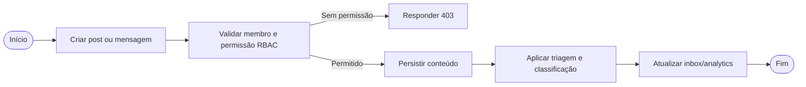

## 1.7 Integração Shopify (sincronização e webhook)

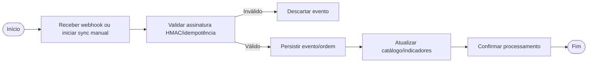

---

## 2) UML — Todos os tipos relevantes para o sistema

## 2.1 Diagrama de Casos de Uso

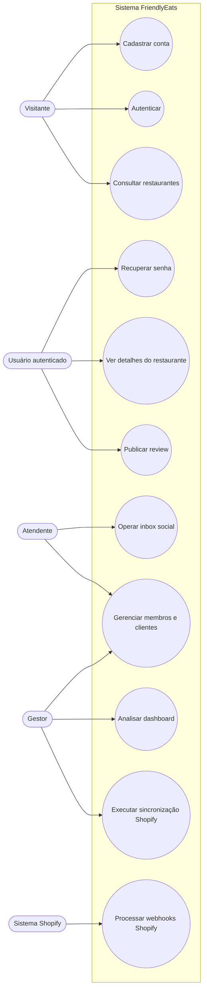

## 2.2 Diagrama de Classes

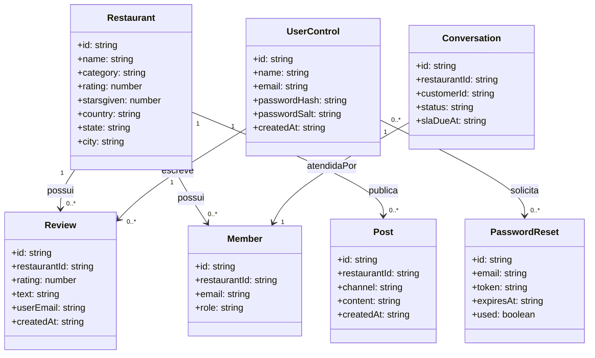

## 2.3 Diagrama de Sequência — Envio de review

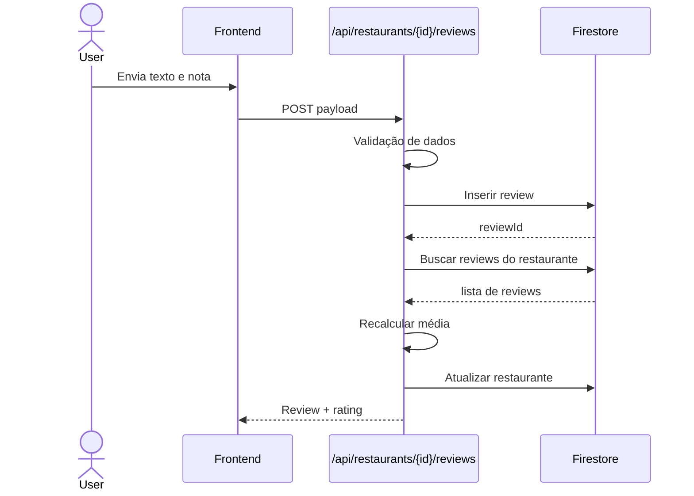

## 2.4 Diagrama de Atividades — Recuperar senha

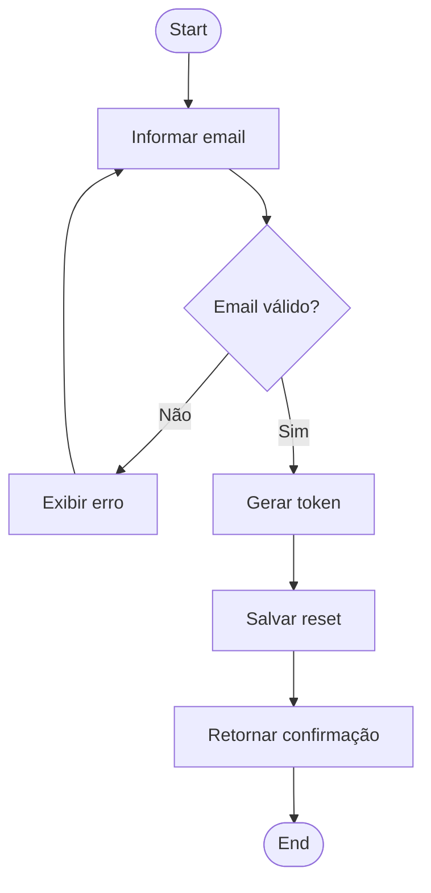

## 2.5 Diagrama de Estados — Conversa do inbox

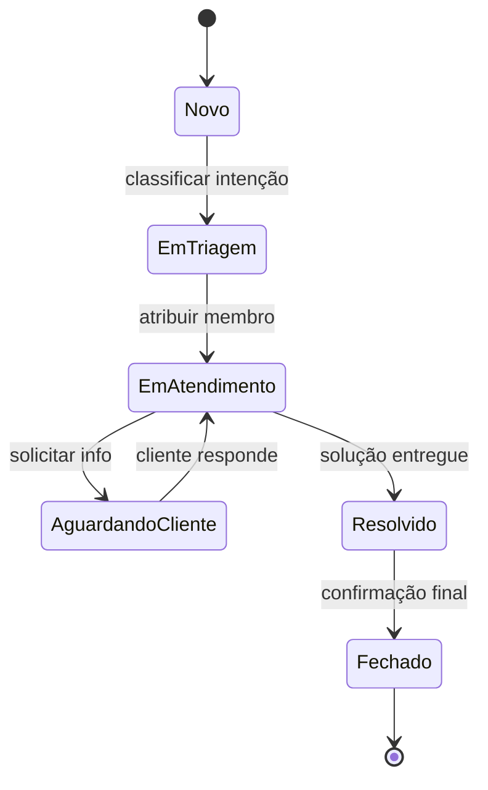

## 2.6 Diagrama de Componentes

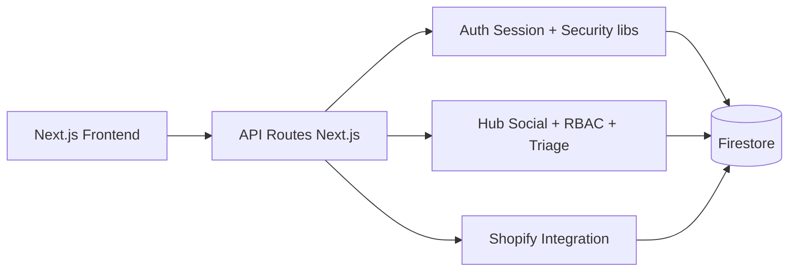

## 2.7 Diagrama de Implantação (Deployment)

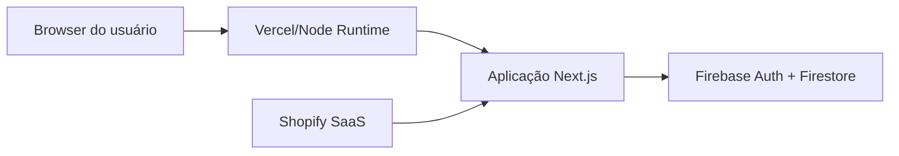

## 2.8 Diagrama de Pacotes

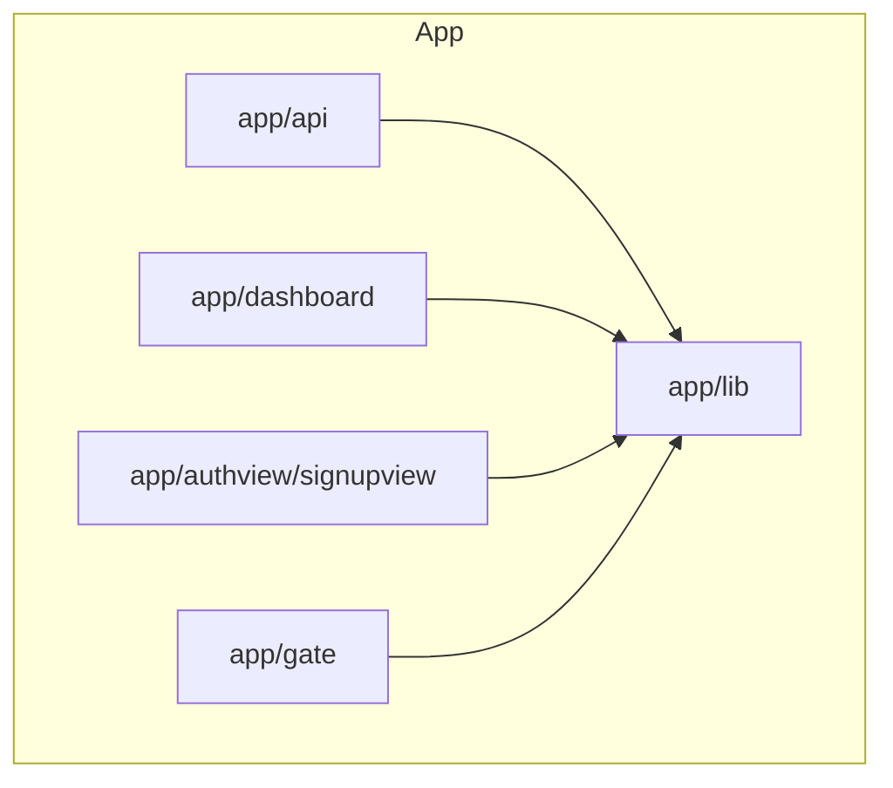

## 2.9 Diagrama de Comunicação (colaboração)

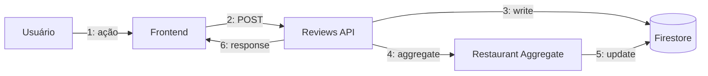

## 2.10 Diagrama Temporal (Timing simplificado)

```mermaid
gantt
  title Timing simplificado - fluxo de review
  dateFormat  X
  axisFormat %L
  section Frontend
  Captura input        :a1, 0, 1
  Envia requisição     :a2, after a1, 1
  section API
  Validação            :b1, 1, 1
  Grava review         :b2, after b1, 1
  Atualiza média       :b3, after b2, 1
  section Persistência
  Write/Read Firestore :c1, 2, 2
```

---

## 3) Diagramas lógico-relacionais de banco (todos os módulos centrais)

## 3.1 ER lógico-relacional consolidado

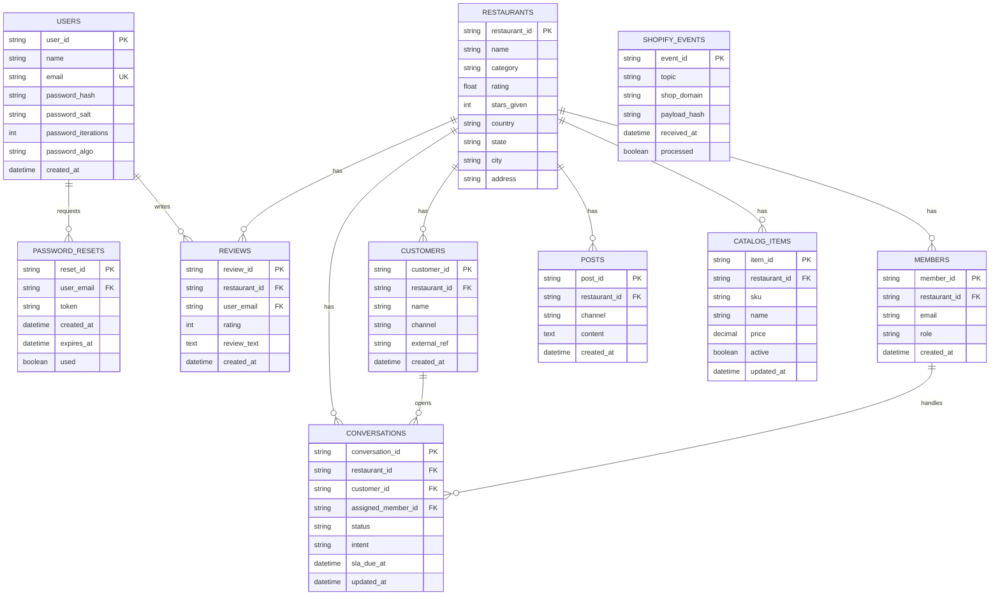

## 3.2 Dicionário lógico resumido

- **USERS**: identidade local e credenciais protegidas por hash/salt.
- **RESTAURANTS**: entidade principal de catálogo e reputação.
- **REVIEWS**: avaliações textuais e numéricas que recalculam nota média.
- **MEMBERS/CUSTOMERS/CONVERSATIONS/POSTS**: núcleo do hub social e atendimento.
- **CATALOG_ITEMS/SHOPIFY_EVENTS**: integração comercial e rastreabilidade de eventos.

---

## 4) Como usar estes diagramas

- Copie os blocos Mermaid para editores compatíveis (GitHub, Mermaid Live Editor, MkDocs etc.).
- Para documentação executiva, exporte cada diagrama em PNG/SVG.
- Para governança técnica, mantenha este arquivo versionado junto com mudanças de API e schema.
